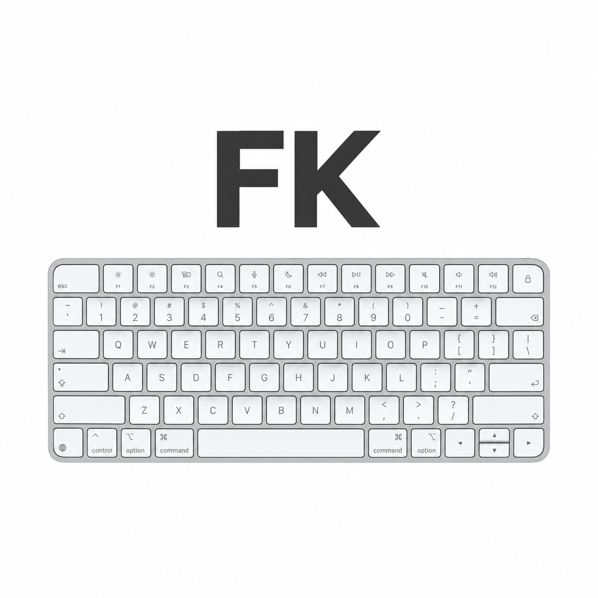

<div align="center">
  
  <h1>FoldableKeyboard</h1>
  <p><strong>为远程 Vibe Coding 而生的虚拟键盘。</strong><br>在折叠屏手机上体验更佳。</p>
  <p>
    <a href="#quick-start">快速开始</a> ·
    <a href="#features">功能特性</a> ·
    <a href="#development">开发</a> ·
    <a href="../README.md">English</a>
  </p>
</div>

FoldableKeyboard 为 Android 提供桌面式按键，通过 UU 远程悬浮键盘控制 Mac 或 Windows 电脑，将熟悉的修饰键和导航键带到展开的手机屏幕上。

UU 浮窗通过 Shizuku 在手机上注册 HID 键盘。普通 Android 输入法仍可独立使用，但二者的输入通道不同：**在系统输入法列表中选择本键盘，不会启动 UU HID 浮窗。**

<a id="quick-start"></a>
## 快速开始

### UU 远程键盘

需要 **Android 14+**、**Shizuku 13+**、悬浮窗权限，以及允许系统 HID 工具和 UHID 设备访问的 ROM。不保证所有手机和 UU 版本均兼容。

1. 安装本仓库 [Releases](https://github.com/ababdotai/FoldableKeyboard/releases) 中可用的 APK，或按下方说明构建 Debug 安装包。
2. 安装并启动 [Shizuku](https://shizuku.rikka.app/zh-hans/guide/setup/)。可通过无线调试免 Root 启动；手机重启后，通常需要重新启动服务。
3. 打开 FoldableKeyboard 设置，在 UU 键盘分组授予 Shizuku 和“显示在其他应用上层”权限，然后启动悬浮键盘。
4. 在 UU 连接远端，选择“电脑键盘”，关闭“输入法”面板，点中远端编辑框。通过我们的浮动按钮或常驻通知恢复键盘。
5. 需要远端中文输入时，在 **Mac 上**选择拼音输入源，再输入 `nihao`。应由远端输入法组成拼音，而非手机输入法提交文字。

使用 Mac 快捷键时，选择 **Mac** 布局，并保持 Command 兼容选项开启。在 UU 的“按键替代”中开启 **右 Ctrl → Cmd**，关闭 **右 Alt → Esc**，并关闭 UU 的“全键盘控制”无障碍功能。真正的 Control 与 Command 仍分别处理。版本差异见 [Mac 组合键说明](mac-keyboard-shortcuts.md)。

### 普通 Android 输入法

在 Android 输入法设置中启用 FoldableKeyboard，再通过键盘选择器切换。普通文字输入不需要 Shizuku。RAW 模式通过目标应用的输入连接发送按键，不会创建外设键盘，也无法解决 UU“输入法”面板过滤字母事件的问题。

<a id="features"></a>
## 功能特性

- **Mac / Windows 布局**：支持 Command、Option、Control、功能键和导航键；Mac 使用倒 T 方向键及 PageUp/PageDn。
- **折叠屏布局**：可调整高度、左右留白、分体布局及功能键行。
- **远程快捷栏**：横向滚动使用全选、复制、粘贴、撤销、重做、查找和保存；复制粘贴操作的是远端应用剪贴板。
- **Magic Keyboard 风格主题**：银白、石墨黑，以及 AMOLED 和自定义主题；外观不改变实际键值。
- **跟随系统明暗**：在设置的“键盘外观”中开启后，普通输入法与 UU 浮窗会随 Android 浅色/深色模式切换银白/黑色主题。默认关闭；关闭后恢复先前手动主题，手动选择主题会退出自动模式。若终端应用为当前输入法会话提供配色，仍优先使用该会话配色。输入法换色时会收起临时面板（含语音）并刷新候选，不替换编辑框文字。
- **浮动与停靠**：支持拖动、收起为小按钮，以及通过常驻通知恢复。
- **分层诊断**：区分权限、服务、设备登记、焦点与 HID 提交问题，不记录输入内容。
- **普通输入法工具**：多语言布局、离线候选、表情、剪贴板历史及空格键光标控制；这些功能并非全部适用于 HID 浮窗。

## 停靠与画面遮挡

停靠利用的是 **UU 已经预留的键盘区域**，不会主动缩放 UU，也不会触发 Android 输入法避让。

1. 展开 UU 自带的“电脑键盘”，让远程画面位于其键盘区域上方。
2. 打开我们的浮窗，选择“停靠”；顶部操作栏可横向滑动。
3. 拖动校准条，或使用高度增减按钮，让窗口上边缘与 UU 键盘区域上边缘对齐。

横竖屏分别记忆高度。诊断面板临时替换按键区，不扩大停靠高度；较小区域会隐藏快捷栏。收起后露出 UU 原键盘。UU 布局改变时需要重新校准；如果 UU 没有预留区域，停靠窗口仍会遮挡画面。

## 输入边界与隐私

HID 设备登记或报告提交成功，不代表 UU 或远端一定收到按键。现有通道已在用户的 UU/Mac 会话中确认可用，但并非所有设备均经过验证。详细步骤见 [使用、诊断与验收说明](uu-remote-keyboard.md)。

浮窗在发送前检查 UU 前台窗口和硬件键盘焦点，不确定时拒绝发送。HID 跟随系统焦点，检查无法完全消除切换焦点的竞争窗口，**输入时不要切换应用**。仅支持主显示屏；这不是蓝牙连接，也不能绕过 Android 权限。

诊断只保留会话聚合计数，不包含文字、键值、剪贴板或设备标识。报告仅在手动导出时生成，不自动上传。普通输入法剪贴板历史是独立的本地功能；更新检查会访问本仓库的 GitHub Releases。

部分组合键会被 Android 或 UU 截获。支持的 Fn+方向键/删除在本地翻译；不模拟媒体键、Touch ID，也不在多次远程命令之间持续保持修饰键按下。

<a id="development"></a>
## 开发

使用 **JDK 17** 和 Android SDK：

```sh
./gradlew :app:assembleDebug       # 可安装的 Debug APK
./gradlew :app:testDebugUnitTest   # JUnit / Robolectric 测试
./gradlew :app:lintDebug           # Android lint
./gradlew :app:assembleRelease     # 未配置签名时生成未签名包
```

Debug 安装包位于 `app/build/outputs/apk/debug/app-debug.apk`。Release 签名需要 `PCK_KEYSTORE_PASSWORD`、`PCK_KEY_PASSWORD`，以及已有的 `app/release.keystore` 或 `PCK_KEYSTORE_FILE`；`PCK_KEY_ALIAS` 可选。应用 ID 保持 `com.pckeyboard.ime`，覆盖安装必须使用相同签名密钥。

Kotlin 源码位于 `app/src/main/java/com/pckeyboard/ime/`：`remote/` 负责浮窗和 HID，`service/` 负责普通输入法，`view/`、`layout/`、`theme/` 提供共享键盘组件。测试位于 `app/src/test/java/`，只读设备探针位于 `test/device/`。自动化测试不等于远端输入已完成端到端验收。

## 许可证与致谢

本项目采用 [GPL v3](../LICENSE)，基于 [9hm2 的上游键盘项目](https://github.com/9hm2/pcKeyboard) 开发；原有版权和许可声明继续适用。

词频词典来自 [FrequencyWords](https://github.com/hermitdave/FrequencyWords) 的 OpenSubtitles-2018 列表（CC-BY-SA 4.0）。词对模型使用 [Leipzig Corpora Collection](https://wortschatz.uni-leipzig.de/en/download) 的 news-2020 语料（CC BY）。Hunspell 资源来自 [LibreOffice dictionaries](https://github.com/LibreOffice/dictionaries)：hu_HU（magyarispell，GPL/LGPL/MPL）、en_US（SCOWL）、de_DE（frami，GPL 3）、es_ES（GPL 3/LGPL/MPL）。Hunspell 实现使用 Apache Lucene（Apache License 2.0）。
